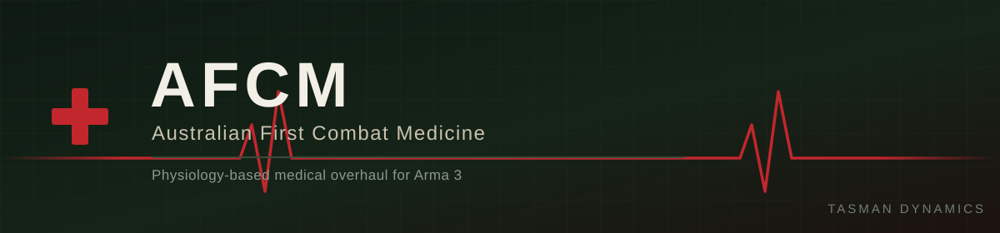

---

**A Tasman Dynamics High-Fidelity Simulation Project**

Australian First Combat Medicine (AFCM) is a next-generation medical overhaul for Arma 3.
Developed under the Tasman Dynamics banner, AFCM abandons the rigid "lock-and-key" item
checklists of legacy mods like ACE, KAT, and ACM. Instead, it introduces a volatile physiology
engine built directly on modern Australian Defence Force (ADF) and Royal Australian Army Medical
Corps (RAAMC) trauma doctrine.

In AFCM, medical success is dictated by physics, chemistry, and environment rather than simple
menu interactions.

---

## ⚙️ Core Pillars

<table>
<tr>
<td width="33%" valign="top">

### 🌡️ The Lethal Triad Engine
Simulates the deadly feedback loop of **Hypothermia**, **Acidosis**, and **Coagulopathy**. Fail
to manage core temperature or blood chemistry, and your patient will succumb to shock despite
your best efforts.

</td>
<td width="33%" valign="top">

### 💉 ADF Protocol Accuracy
Authentic pharmacology — **Ketamine**, **Penthrox**, **Fentanyl Lozenges** — and the **Calcium
Triangle**, where massive transfusions require **Calcium Gluconate** to prevent unshockable
cardiac arrest.

</td>
<td width="33%" valign="top">

### 🧠 Dynamic Realism
Physics-based **airway occlusion**, a **GCS-based neurological system** that integrates with
TFAR/ACRE2 to suppress voice projection, and a **stress-linked matrix** that penalises medic
performance under fire.

</td>
</tr>
</table>

*Tasman Dynamics: Engineering high-fidelity systems for the future of multi-domain simulation.*

---

## 🫀 Reference Equipment

AFCM's cardiac-arrest mechanic is modelled on the **LIFEPAK 15**, the monitor/defibrillator
standard across Australian ambulance services — manual-mode defibrillation, shockable/unshockable
rhythm gating, noninvasive pacing, and 12-lead ECG monitoring. See
[TERMINOLOGY.md §9](docs/TERMINOLOGY.md#9-equipment--devices) for the full breakdown.

## 🧾 Requirements

| Dependency | Status |
|---|---|
| [Community Base Addons (CBA_A3)](https://github.com/CBATeam/CBA_A3) | Required |
| ACE3 / KAT - Advanced Medical / ACM | **Not used** — AFCM is a standalone replacement, not an add-on to legacy medical mods |

## 🔗 Related Projects

| Project | Role |
|---|---|
| [AFCM-Simulator](https://github.com/A3-TasmanDynamics/AFCM-Simulator) | Scenario authoring, patient spawning, and training UI built on top of AFCM's physiology engine |

## 📚 Documentation

| Doc | What's in it |
|---|---|
| [DESIGN.md](docs/DESIGN.md) | Full architecture — physiology model, pharmacology, MP authority, phased roadmap |
| [TERMINOLOGY.md](docs/TERMINOLOGY.md) | Canonical glossary — clinical, tactical-medicine, and radio-callings terminology, each entry sourced |
| [REFERENCES.md](docs/REFERENCES.md) | Every clinical/medical source used to ground AFCM's numbers and doctrine claims |
| [ADF_SME_QUESTIONS.md](docs/ADF_SME_QUESTIONS.md) | Standalone question list for a real ADF/RAAMC member to review |

## 🗺️ Status

**Design phase.** Nothing here is in-code yet — see [DESIGN.md §9](docs/DESIGN.md#9-phased-roadmap)
for the planned build order:

`v1` Lethal Triad core loop → `v2` Pharmacology + cardiac/defib → `v3` Airway + GCS/neuro →
`v4` Medic stress + TFAR/ACRE2 integration

## 📜 License

Released under the [Arma Public License Share Alike (APL-SA)](https://www.bohemia.net/community/licenses/arma-public-license-share-alike).

---

Questions or want to help ground the doctrine in the real thing? [Join the Tasman Dynamics Discord](https://discord.gg/RmCkSuSHRa).

